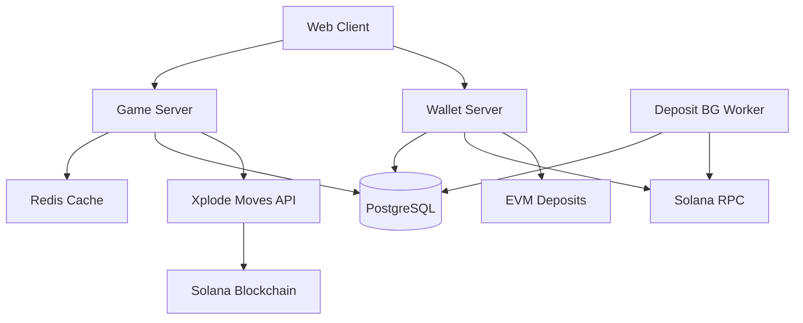

# 💣 Xplode - On-Chain PvP Grid Engine for Strategy Games
<div align="center">


[🎮 Play Now](https://playxplode.xyz) | [🐦 Follow Us](https://x.com/xplode_game)

</div>

---

## 🚀 See Xplode in Action: Blazing-Fast On-Chain Gameplay

<div align="center">
  <video src="gameplay.mp4" autoplay muted controls width="700" poster="https://img.youtube.com/vi/VIDEO_ID/maxresdefault.jpg">
    Your browser does not support the video tag.
  </video>
</div>

---

## 🚀 Overview

**Witness Xplode's blazing-fast Mines Battle Royale—where every move is transparent & strategic.**

Xplode is a revolutionary take on the classic minesweeper game, combining real-time multiplayer gameplay with blockchain technology. Players can bet using real cryptocurrencies, have their moves recorded on-chain at lightning speed, and compete for prizes in a provably fair gaming environment.

**No lag. No gas. Just pure adrenaline 🎮**

Powered by [MagicBlock's](https://www.magicblock.xyz/) ephemeral rollups, Xplode achieves **sub-50ms latency** and **1ms block times**, making on-chain gaming feel like Web2 while maintaining full blockchain transparency and security. Every move is recorded instantly on Solana without compromising speed or user experience.

### ✨ Key Features

- ⚡ **Lightning-Fast On-Chain**: Sub-50ms latency with MagicBlock's ephemeral rollups
- 🎯 **Real-time Multiplayer**: WebSocket-based gaming with instant move synchronization
- 💰 **Multi-Currency Support**: SOL, USDC betting with zero gas fees
- 🔗 **Transparent Blockchain**: Every move recorded on Solana at Web2 speeds  
- 🏆 **Competitive Gaming**: Leaderboards, PnL tracking, and tournament support
- 🎨 **NFT Messaging**: Mint special NFTs for in-game communication and expressions
- 🔐 **Provably Fair**: Cryptographically secure random number generation

## 🏗️ Architecture



### 🔧 Core Services

| Service | Port | Description |
|---------|------|-------------|
| **Game Server** | 3000 | WebSocket-based multiplayer game logic with geo-localized matchmaking |
| **Wallet Server** | 8080 | HTTP API for deposits, withdrawals, user management, and transaction handling |
| **Deposit Worker** | - | Background service for processing blockchain deposits |
| **Discovery Service** | - | Redis-based service for intelligent server routing and player matchmaking |

## 🎮 How It Works

1. **Blazing-Fast Matchmaking**: Intelligent server localization redirects players to servers closest to game creators
2. **Game Creation**: Players create or join game rooms with customizable parameters
3. **Betting**: Set bet amounts in supported cryptocurrencies (SOL, USDC)
4. **Lightning Gameplay**: Take turns revealing cells in a minesweeper grid with sub-50ms response times
5. **Instant Blockchain Recording**: Each move is recorded on Solana blockchain via MagicBlock's ephemeral rollups
6. **Real-time Settlement**: Winners receive the pot instantly with zero gas fees
7. **NFT Messaging**: Mint special NFTs for in-game communication and player expressions
8. **Instant Rematch**: Real-time rematch confirmations feel almost instantaneous

> **🚀 LIVE on Devnet!** Experience the future of on-chain gaming with Web2-level performance.

### 🎯 Game Mechanics

- **Intelligent Matchmaking**: Server localization for optimal latency based on game creator location
- **Grid Sizes**: Customizable from small (8x8) to large grids  
- **Bomb Density**: Adjustable number of mines per game
- **Turn-Based**: Players alternate moves until someone hits a mine
- **Time Limits**: Configurable time limits to keep games moving
- **Instant Rematch**: Real-time rematch confirmations with sub-second response times
- **NFT Communication**: Express yourself through mintable in-game NFT messages

## 🛠️ Technology Stack

### Core Gaming Infrastructure
- **Language**: Rust 🦀
- **Web Framework**: Actix-web
- **WebSocket**: tokio-websockets
- **Database**: PostgreSQL with SQLx
- **Cache**: Redis

### Blockchain Infrastructure
- **MagicBlock Ephemeral Rollups**: 1ms block times, sub-50ms latency
- **Solana Blockchain**: Base layer for final settlement
- **Anchor Framework**: Smart contract development
- **Xplode Moves API**: Custom game state management

### Infrastructure  
- **Containerization**: Docker with multi-region deployment
- **Deployment**: Fly.io with intelligent server localization
- **Monitoring**: Built-in health checks and metrics
- **Scalability**: Horizontal scaling with Redis-based discovery and geo-routing
- **Load Balancing**: Smart player routing to optimal game servers

### Blockchain Integration
- **MagicBlock Ephemeral Rollups**: Sub-50ms latency for real-time on-chain gaming
- **Solana Program**: Custom program for game state management via Xplode Moves API
- **Lightning Move Recording**: Each game move recorded on-chain at Web2 speeds
- **Zero Gas Fees**: Gasless transactions for seamless user experience
- **Secure RNG**: Cryptographically secure random number generation
- **Multi-Signature**: Treasury management with multi-sig support

## 🚀 Quick Start

### Prerequisites
- Rust 1.70+
- PostgreSQL 14+
- Redis 6+
- Solana CLI tools

### Installation

1. **Clone the repository**
```bash
git clone https://github.com/your-username/mines-backend.git
cd mines-backend
```

2. **Set up environment variables**
```bash
cp .env.example .env
# Edit .env with your database and blockchain configurations
```

3. **Database setup**
```bash
# Create database and run migrations
psql -f migrations/create_schema.sql
```

4. **Build and run**
```bash
# Build all services
cargo build --release

# Run game server
cd server && cargo run

# Run wallet server (in another terminal)
cd wallet && cargo run
```

## 🏆 Game Features

### Supported Currencies
- **SOL**: Native Solana token
- **USDC**: USD Coin stable currency

### Game Modes
- **Quick Match**: Blazing-fast matchmaking with intelligent server localization
- **Private Rooms**: Create custom games with friends on optimized servers
- **Tournaments**: Structured competitive events with real-time progression
- **Practice Mode**: Free play for learning without gas fees

### NFT Communication System
- **Express Emotions**: Mint GIF-based NFTs for in-game reactions
- **Player Interactions**: Send NFT messages during gameplay
- **Community Building**: Collect and trade unique communication NFTs
- **Achievement Unlocks**: Special NFTs for gameplay milestones

## 🔒 Security Features

- **On-Chain Verification**: All game moves recorded on blockchain
- **Multi-Signature Treasury**: Secure fund management
- **Rate Limiting**: Protection against abuse and spam
- **Input Validation**: Comprehensive validation of all user inputs


## 🚀 Deployment

The project is designed for cloud deployment with Docker containerization:

```bash
# Deploy game server
docker build -f server/Dockerfile.game-server -t xplode-game .
docker run -p 3000:3000 xplode-game

# Deploy wallet server (handles all wallet functionality)
docker build -f wallet/Dockerfile.wallet-server -t xplode-wallet .
docker run -p 8080:8080 xplode-wallet
```


## 🤝 Contributing

We welcome contributions!

### Development Guidelines
- Follow Rust best practices and conventions
- Add tests for new functionality
- Update documentation for API changes
- Ensure all tests pass before submitting

## 📄 License

This project is licensed under the MIT License - see the [LICENSE](LICENSE) file for details.

## 🔗 Links & Community

- **Website**: [playxplode.xyz](https://playxplode.xyz)
- **Twitter**: [@xplode_game](https://x.com/xplode_game)
- **Demo Video**: [Watch Demo](https://x.com/xplode_game/status/1925801438573130082)

## 🙏 Acknowledgments

**Shoutout to [MagicBlock](https://www.magicblock.xyz/) for making on-chain gaming real-time**

<!-- Add your demo video here -->
> **📹 [Watch Live Gameplay Demo]** - *Coming Soon: Embedded gameplay video showcasing sub-50ms on-chain moves*

MagicBlock's ephemeral rollups have revolutionized our gaming experience, enabling:
- **Sub-50ms latency** for real-time blockchain gaming
- **Zero gas fees** for seamless user experience  
- **Horizontal scaling** for massive multiplayer support

> **🤝 Community-Driven Development**: We believe in building with our community. Join our Discord to influence the roadmap!

---

<div align="center">

**Built with ❤️ using Rust, Solana & MagicBlock**

*Bringing blockchain gaming to the mainstream, one mine at a time* 💥

</div> 